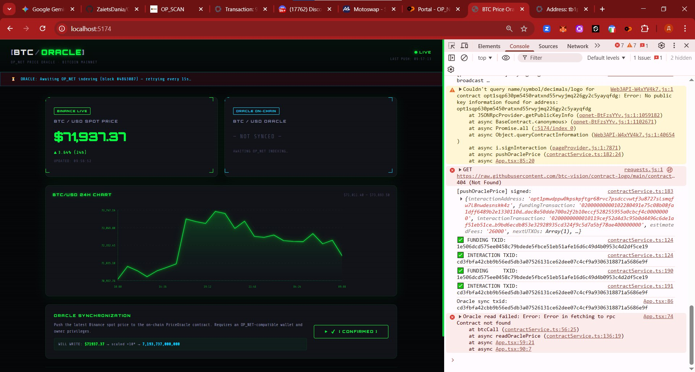

# BTC Price Oracle — OP_NET

A Bitcoin-native price oracle built on OP_NET smart contracts. Fetches live BTC/USD spot prices from Binance API and pushes them on-chain via a contract deployed on Bitcoin Testnet.

---

## Live Demo

**[https://frontend-sigma-one-35.vercel.app](https://frontend-sigma-one-35.vercel.app)**

---

## Proof of Work — Week 2 Final

| Field | Value |
|---|---|
| **Interaction TXID** | `cd3fbfa42cbb9b56ed5db3a07526131ce62dee07c4cf9a9306318871a5686e9f` |
| **Method** | Emergency Protocol (`signInteraction` + manual mempool.space broadcast) |
| **Result** | Oracle sync successful |



---

## Architecture

- **Frontend:** React + Vite + TypeScript (Cyberpunk UI)
- **Data Source:** Binance Public API
- **On-chain:** OP_NET Smart Contract

---

## Project Structure

```
/contract    — OP_NET smart contract (AssemblyScript)
/frontend    — Cyberpunk UI dashboard (React + Vite + TypeScript)
/docs/demo   — Screenshots and proof of work
```

---

## Deployment (Bitcoin Testnet3)

| Field | Value |
|---|---|
| **Contract Address** | `opt1sqp630pm5450ratxnd55rwyjmq226gy2c5yayqfdg` |
| **Contract Hash** | `0x74f381ba78cd46c6683969a41e11dbf83f62861faa675299c4091f360763a2c8` |
| **Network** | Bitcoin Testnet3 |
| **Protocol** | OP_NET v1 |
| **Price Scale** | ×10⁸ (satoshi precision) |

---

## Frontend — Quick Start

```bash
cd frontend
npm install
npm run dev
```

Open [http://localhost:3000](http://localhost:3000)

---

## Setup

```bash
# Contract
cd contract
npm install
cp .env.example .env   # fill WALLET_WIF, MLDSA_PRIVATE_KEY, CONTRACT_ADDRESS
node deploy.mjs        # deploy to testnet
node set-price.mjs     # push initial price

# Frontend
cd frontend
npm install
cp .env.example .env   # fill VITE_CONTRACT_ADDRESS, VITE_CONTRACT_HEX
npm run dev
```

## Environment Variables

### `contract/.env`
```
NETWORK=testnet
RPC_URL=https://testnet.opnet.org
WALLET_WIF=<your WIF key>
MLDSA_PRIVATE_KEY=<2560-byte hex>
CONTRACT_ADDRESS=opt1sqp630pm5450ratxnd55rwyjmq226gy2c5yayqfdg
CONTRACT_HEX=0x74f381ba78cd46c6683969a41e11dbf83f62861faa675299c4091f360763a2c8
```

### `frontend/.env`
```
VITE_CONTRACT_ADDRESS=opt1sqp630pm5450ratxnd55rwyjmq226gy2c5yayqfdg
VITE_CONTRACT_HEX=0x74f381ba78cd46c6683969a41e11dbf83f62861faa675299c4091f360763a2c8
VITE_OPNET_RPC_URL=https://testnet.opnet.org
```

## Stack

| Layer    | Tech                              |
|----------|-----------------------------------|
| Contract | OP_NET / AssemblyScript           |
| Frontend | React 18, Vite 5, TypeScript 5    |
| Wallet   | OP Wallet (`window.opnet`)        |
| Price    | Binance REST API                  |
| Network  | Bitcoin Testnet3 / OP_NET         |
